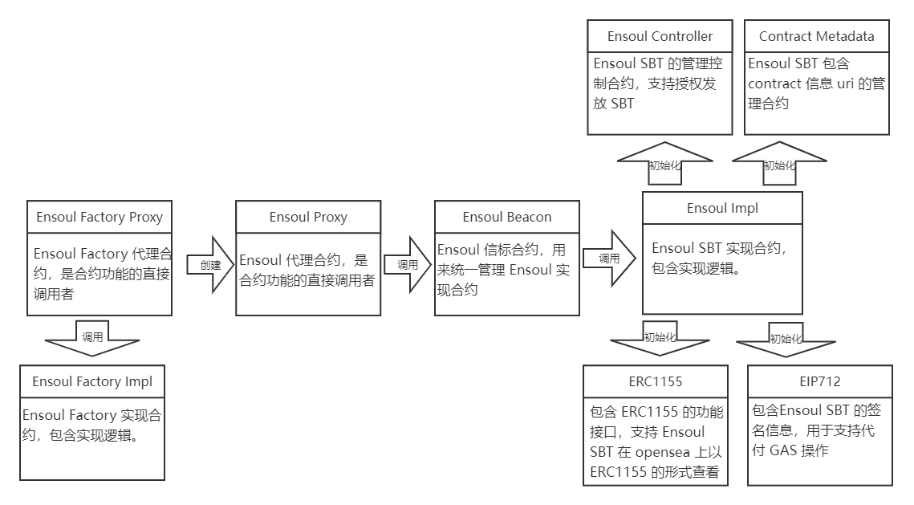

# 合约结构说明



# Ensoul_Factory.sol

Ensoul_Factory.sol 合约是用来直接部署的工厂合约，可以调用来部署 Ensoul SBT 合约。

### newOrg

该方法用于创建新的 Ensoul SBT 组织，需要传入所有者、包含 token 信息的 uri、包含 contract 信息的 uri 三个参数。该方法只能由 Ensoul 官方管理调用，用于创建通过审核的组织。

eg：

- _tokenURI如 http://baidu.com/json?{id}.json
- _contractURI如 http//baidu.com/json?contracnt.json

```solidity
function newOrg(
    address _orgOwner, // 所有者
    string memory _tokenURI, // 包含 token 信息的 uri
    string memory _contractURI // 包含 contract 信息的 uri
    string memory _name // sbt 名字
) public onlyEnsoulAdmin;
```

### orgs

该变量用于存储所有创建过的 Ensoul SBT 组织，输入 Index 即可查询对应顺序的 Ensoul SBT 地址。

```solidity
address[] public orgs;
```

# Ensoul.sol

Ensoul.sol 合约是 Ensoul SBT 的主体合约，用来桥接 ERC1155、Ensoul Controller、ContractURI 等合约。

### constructor

Ensoul SBT 合约初始化函数，接受 Ensoul Factory 合约传入的参数，初始化 ERC1155、Ensoul Controller、ContractURI 和 EIP712。

```solidity
constructor(
    address _owner, // 所有者
    string memory _tokenURI, // 包含 token 信息的 uri
    string memory _contractURI // 包含 contract 信息的 uri
		string memory _name // sbt 名字
) ERC1155(_tokenURI) Ensoul_Controller(_owner) EIP712("Ensoul", "1.0.0");
```

### uri

该方法用于返回包含 tokenId 信息的 uri 地址，uri 地址保存了 tokenId 的图片、名称、描述等详细信息。

```solidity
function uri(
	uint256 tokenId // 需要查询的 tokenId
) public view returns (
	string memory // 包含 tokenId 信息的 uri
);
```

### mintToBatchAddressBySignature

该方法支持授权者使用签名发放 SBT，发放 SBT 所需要的 GAS 费用可以由 Ensoul 官方代付，也可以由接收 SBT 的用户支付。

```solidity
function mintToBatchAddressBySignature(
    address[] memory toList, // 发放地址列表
    uint256 tokenId, // 发放 tokenId
    uint256 amount, // 发放数量
		uint256 expiration, // 过期时间
    uint8 v, //签名数据 vrs
    bytes32 r,
    bytes32 s
) external;
```

### mintToBatchAddress

如果授权者不需要别人支付GAS，可以使用该方法自己支付 GAS 发放 SBT

```solidity
function mintToBatchAddress(
		 address[] memory toList,// 发放地址列表
	   uint256 tokenId, // 发放 tokenId
	   uint256 amount // 发放数量
 ) external override onlyOrgAmin(tokenId);
```

### mint

支持授权者发放单个 SBT

```solidity
function mint(
    address account,// 发放地址
    uint256 id,// 发放 tokenId
    uint256 amount // 发放数量
) external override onlyOrgAmin(id) {
    super._mint(account, id, amount, "");
}
```

### mintToBatchAddress

支持授权者使用签名发放单个 SBT

```solidity
function mintBySignature(
    address to, // 发放地址
    uint256 tokenId, // 发放 tokenId
    uint256 amount, // 发放数量
		uint256 expiration, // 过期时间
	  uint8 v, // 签名数据
    bytes32 r,
    bytes32 s
) external override {
    address signer = ECDSA.recover(
        _hashTypedDataV4(keccak256(abi.encode(MINT_TYPEHASH, to, tokenId, amount))),
        v,
        r,
        s
    );
    require(this.isAllow(signer, tokenId), "ERR_NO_AUTH_OF_TOKEN");
    super._mint(to, tokenId, amount, "");
}
```

### burn

仅支持 SBT 所有者自己销毁自己的 SBT。

```solidity
function burn(
	uint tokenId // 需要销毁的 tokenId
) external;
```

### pause

只有 SBT 所有者可以暂停合约，暂停之后不能发放 SBT。

```solidity
function pause() external onlyOwner;
```

### unpause

只有 SBT 所有者可以在暂停之后重启合约，重启之后可以继续发放 SBT。

```solidity
function unpause() external onlyOwner;
```

### setURI

所有者可以重新设置包含 token 信息的 uri。

```solidity
function setURI(
	string memory newuri // 包含 token 信息的新 uri
) external onlyOwner;
```

### setContractURI

所有者可以重新设置包含 contract 信息的 uri。

```solidity
function setContractURI(
	string memory contractURI_  // 包含 contract 信息的新 uri
) external onlyOwner;
```

# Ensoul_Controller.sol

Ensoul_Controller.sol 是 Ensoul SBT 的管理控制合约，支持授权发放 SBT。

### constructor

初始化 Ensoul Controller 合约需要传入所有者地址作为最高权限地址。

```solidity
constructor(
		address _owner // 所有者
);
```

### isAllow

检查发行者是否有发放某 tokenId 的权限，会检查授权链，如果授权链不完整则没有发行权限。

```solidity
function isAllow(
	address sender, // 发行者 
	uint256 tokenId // 要发行的 tokenId
) external view returns (
	bool // 是否有授权
);
```

### addOrgAdmin

所有者可以添加管理员，管理员有发行任意 tokenId 的权限。

```solidity
function addOrgAdmin(
	address admin // 授权地址
) external onlyOwner;
```

### allow

授权者可以授权某个用户发放某个 tokenId 的权限。

```solidity
function allow(
	address to, // 授权地址
	uint256 tokenId // 授权 tokenId
) external onlyOrgAmin(tokenId);
```

### allowBatch

批量授权某个用户发放某个 tokenId 的权限。

```solidity
function allowBatch(
	address[] memory toList, // 授权地址列表
	uint256[] memory tokenIdList // 授权 tokenId 列表
) external;
```

### revokeOrgAdmin

所有者可以移除管理员。

```solidity
function revokeOrgAdmin(
	address admin // 解除授权地址
) external onlyOwner;
```

### revokeAllow

授权者可以解除授权某个用户发放某个 tokenId 的权限。

```solidity
function revokeAllow(
	address to, // 解除授权地址
	uint256 tokenId // 解除授权的 tokenId
) external onlyOrgAmin(tokenId);
```

### revokeAllowBatch

批量解除授权某个用户发放某个 tokenId 的权限。

```solidity
function revokeAllowBatch(
	address[] memory toList, // 解除授权地址列表
	uint256[] memory tokenIdList // 解除授权 tokenId 列表
) external;
```

# ContractMetadata.sol

ContractMetadata.sol 是 Ensoul SBT 的 contract 信息 uri 管理合约。

### contractURI包含 contract 信息的新 uri

获取 contract 信息 uri，暴露给 opensea 等平台

```solidity
function contractURI() public view returns (
		string memory // 包含 contract 信息的 uri
);
```

# ERC1155

包含 ERC1155 的功能接口，支持 Ensoul SBT 在 opensea 上以 ERC1155 的形式查看。

### constructor

初始化 ERC1155 需要传入包含 token 信息的 uri

```solidity
constructor(
		string memory uri_ // 包含 token 信息的 uri
);
```

### supportsInterface

查询支持的合约接口

```solidity
function supportsInterface(
		bytes4 interfaceId // 合约接口 interfaceId
) public view returns (
		bool // 是否支持
);
```

### balanceOf

查询账户拥有的 tokenId 数量

```solidity
function balanceOf(
		address account, // 账户地址
		uint256 id // tokenId
) public view returns (
		uint256 // 数量
);
```

### balanceOfBatch

批量查询账户拥有的 tokenId 数量

```solidity
function balanceOfBatch(
		address[] memory accounts, // 账户地址列表
		uint256[] memory ids // tokenId列表
) public view returns (
		uint256[] memory // 数量列表
);
```

### burnBatch

批量销毁用户自己拥有的 tokenId。

```solidity
function burnBatch(
    address account, // 账户地址
    uint256[] memory ids, // tokenId列表
    uint256[] memory values // 数量列表
) public;
```

### totalSupply

查看 tokenId 对应的发行数量。

```solidity
function totalSupply(
		uint256 id // tokenId
) public view returns (
		uint256 // 数量
);
```

### exists

查看 tokenId 是否已经发行。

```solidity
function exists(
		uint256 id // tokenId
) public view returns (
		bool // 是否发行
);
```

# EIP712

包含Ensoul SBT 的签名信息，用于支持代付GAS进行操作。

### constructor

初始化 EIP712 需要传入合约名和合约版本，确保签名不会被用在其他地方。

```solidity
constructor(
		string memory name, // 合约名
		string memory version // 合约版本
);
```